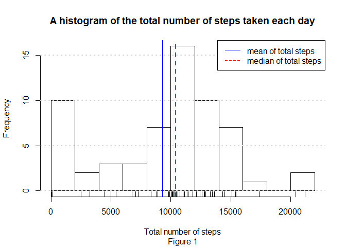

```r
#loading libraries
library(dplyr)
library(ggplot2)
library(lubridate)
```

## Loading and preprocessing the data
Reading the data given as a part of assignment.  
- Dataset: [Activity monitoring dat](https://d396qusza40orc.cloudfront.net/repdata%2Fdata%2Factivity.zip) [52K]

```r
df <- read.csv("activity.csv")

head(df)
```

```
##   steps       date interval
## 1    NA 2012-10-01        0
## 2    NA 2012-10-01        5
## 3    NA 2012-10-01       10
## 4    NA 2012-10-01       15
## 5    NA 2012-10-01       20
## 6    NA 2012-10-01       25
```

We can see that there are NA values in the dataset. Lets take a look which columns have NA values and what is the total no of NA's present in the dataset.

```r
sapply(df, function(x) sum(is.na(x)))
```

```
##    steps     date interval 
##     2304        0        0
```
So there are 2304 NA values in 'steps' column only. We will take a look at those more leter.

Before we get started with the assignment, lets backup the data. 

```r
backup_df <- df
```


## What is mean total number of steps taken per day? 

#### 'Calculate the total number of steps taken per day'  
  
To calculate the total no of steps taken perday we will group the data by 'date' and perform a 'sum' operation on 'steps'

```r
sub_df1 <- df %>% group_by(date) %>% 
    summarise(total_steps = sum(steps,na.rm = T),
              mean_by_day = mean(steps,na.rm = T),
              median_by_day = median(steps, na.rm = T))
head(sub_df1)
```

```
## # A tibble: 6 x 4
##   date       total_steps mean_by_day median_by_day
##   <fct>            <int>       <dbl>         <dbl>
## 1 2012-10-01           0     NaN                NA
## 2 2012-10-02         126       0.438             0
## 3 2012-10-03       11352      39.4               0
## 4 2012-10-04       12116      42.1               0
## 5 2012-10-05       13294      46.2               0
## 6 2012-10-06       15420      53.5               0
```
**'sub_df1'** contains the total no of steps per day.  
  
We can see that NA is introdused in the dataset. Lets take look at the NA values. Also it is interesting to see that all the values in 'median_by_day' column is zero. Lets take a closer look at that too.


```r
sapply(sub_df1, function(x) sum(is.na(x)))
```

```
##          date   total_steps   mean_by_day median_by_day 
##             0             0             8             8
```
There are 8 NA values in both 'mean_by_day' and 'median_by_day'. Lets check if both colums have NA values for those 8 values.

```r
idx <- intersect(which(is.na(sub_df1$mean_by_day)),
                 which(is.na(sub_df1$median_by_day)))
idx
```

```
## [1]  1  8 32 35 40 41 45 61
```
So for the 8 na value rows both 'mean_by_day' and 'median_by_day' have NA.  
Lets take a look at the 'steps' values present in 'df' for those dates with NA.  

```r
dates <- sub_df1[idx,"date"]
df %>% filter(date %in% as.character(dates$date)) %>% 
    select(steps,date) %>% group_by(date) %>% summarise(uniq = unique(steps))
```

```
## # A tibble: 8 x 2
##   date        uniq
##   <fct>      <int>
## 1 2012-10-01    NA
## 2 2012-10-08    NA
## 3 2012-11-01    NA
## 4 2012-11-04    NA
## 5 2012-11-09    NA
## 6 2012-11-10    NA
## 7 2012-11-14    NA
## 8 2012-11-30    NA
```
Suprising that code was executed, if 'unique' returned a vector of size 2 or more it would throw an error an error *'Error: Column `uniq` must be length 1 (a summary value), not 3'*.  
It seems that the NA values in 'mean_by_day' and 'median_by_day' are the result of having on 'steps' values for those perticular dates.  

Now lets look at 'median_by_day' col of 'sub_df1'.

```r
table(sub_df1$median_by_day)
```

```
## 
##  0 
## 53
```
We have in total on 61 days in the dataset but as for 8 days there is no values we can only see 53 days, for all those those days the median in 0. Thats interesting. Lets take a look 'df' for more info.

```r
df %>% filter(!(date %in% as.character(dates$date))) %>% 
    group_by(date) %>% 
    summarise(counts = n(),
              n_zore_steps = sum(steps == 0),
              fraction_zero_steps = n_zore_steps/counts) -> temp1
temp1[temp1$fraction_zero_steps < 0.65,]
```

```
## # A tibble: 7 x 4
##   date       counts n_zore_steps fraction_zero_steps
##   <fct>       <int>        <int>               <dbl>
## 1 2012-10-06    288          182               0.632
## 2 2012-10-07    288          180               0.625
## 3 2012-10-10    288          184               0.639
## 4 2012-10-12    288          177               0.615
## 5 2012-10-13    288          184               0.639
## 6 2012-10-28    288          184               0.639
## 7 2012-11-22    288          173               0.601
```
We can see that for all the date except the 'dates' where there is no 'steps' values, more than 50% values are 0 for each day. That is why 'median_by_day' in 'sub_df1' is all 0.  

#### 'Make a histogram of the total number of steps taken each day'  
Lets construct a histogram of the total steps taken.  

```r
hist(sub_df1$total_steps,
     main='A histogram of the total number of steps taken each day',
     xlab = 'Total number of steps',breaks = 10,sub="Figure 1")
rug(sub_df1$total_steps)
grid(NA,NULL,lwd=2)
abline(v=mean(sub_df1$total_steps),lwd = 2,col =4)
abline(v=median(sub_df1$total_steps),lty=2,lwd = 2,col =2)
legend("topright",col = c(4,2),lty=c(1,2),
       legend = c("mean of total steps","median of total steps"))
```

<!-- -->
  
#### 'Calculate and report the mean and median of the total number of steps taken per day'  
**'sub_df1'** coulmn 'mean_by_day' and 'median_by_day' has the mean and the median steps for each day.  

Mean of total steps : 9354.2295082  
Median of total steps " 10395  

## What is the average daily activity pattern?  

#### 'Make a time series plot of the 5-minute interval (x-axis) and the average number of steps taken, averaged across all days (y-axis)'

Lets group the data by interval and summarise:

```r
sub_df2 <- df %>% group_by(interval) %>% 
    summarise(total_steps = sum(steps,na.rm = T),
              mean_by_interval = mean(steps,na.rm = T),
              median_by_interval = median(steps, na.rm = T))
head(sub_df2)
```

```
## # A tibble: 6 x 4
##   interval total_steps mean_by_interval median_by_interval
##      <int>       <int>            <dbl>              <int>
## 1        0          91           1.72                    0
## 2        5          18           0.340                   0
## 3       10           7           0.132                   0
## 4       15           8           0.151                   0
## 5       20           4           0.0755                  0
## 6       25         111           2.09                    0
```
  
Lets check for NA values and check if 'median_by_interval' is acting the same way as 'median_by_day' from 'sub_df1'.  

```r
sapply(sub_df2, function(x) sum(is.na(x)))
```

```
##           interval        total_steps   mean_by_interval 
##                  0                  0                  0 
## median_by_interval 
##                  0
```
  
So no NA valus thats a good sign!!  
'median_by_interval'

```r
table(sub_df2$median_by_interval)
```

```
## 
##   0   6   7   8   9  10  12  13  14  15  16  18  19  20  24  25  26  28 
## 235   1   7   4   1   2   1   3   1   3   2   1   3   1   1   2   3   1 
##  30  31  32  33  34  37  41  42  43  45  51  60 
##   2   1   1   4   1   1   1   1   1   1   1   1
```
  
We have several values here.  
So lets move forward with the plot.

```r
par(mar = c(4,4,3,1))
with(sub_df2,plot(interval,median_by_interval,type="l",
                  main = "Time series plot of the 5-minute interval and\nthe average number of steps taken, averaged across all days",
                  xlab = "5-minute interval",
                  ylab = "Average number of steps taken",sub="Figure 2"))
grid(NA,NULL,lwd=2)
```

<!-- -->
  
#### 'Which 5-minute interval, on average across all the days in the dataset, contains the maximum number of steps'  


```r
interval_r <- sub_df2[which.max(sub_df2$mean_by_interval),'interval']
```
  
5-minute interval: **835** has the maximum number of steps on average across all the days in the dataset.  

## Imputing missing values  

#### 'Calculate and report the total number of missing values in the dataset'  

Total no of NA's in dataset:  

```r
sum(is.na(df))
```

```
## [1] 2304
```
  
By colums:

```r
sapply(df, function(x) sum(is.na(x)))
```

```
##    steps     date interval 
##     2304        0        0
```
  
#### 'Devise a strategy for filling in all of the missing values in the dataset.'  
From "Figure 1" and "Figure 2" it is clear that 'steps' are highly depended on both the 'date' and 'interval'. So relativly simple way to impute NA values in 'steps' would be to use both 'date' and 'interval'.  
NA values should be imputed with the mean of "sub_df1 cloumn mean_by_day" and "sub_df2 cloumn mean_by_interval".  

```r
idx <- which(is.na(df$steps))
unique(df[idx,]$date)
```

```
## [1] 2012-10-01 2012-10-08 2012-11-01 2012-11-04 2012-11-09 2012-11-10
## [7] 2012-11-14 2012-11-30
## 61 Levels: 2012-10-01 2012-10-02 2012-10-03 2012-10-04 ... 2012-11-30
```

```r
all(as.character(unique(df[idx,]$date)) %in% as.character(dates$date))
```

```
## [1] TRUE
```
  
But it seems like NA values in steps are for only those dates we looked at before.  
These dates have no 'steps' values for the whole day so "sub_df1 cloumn mean_by_day" is also NA.  
So lets check if there is a pattern in weekdays of the date.  

```r
wend <- c("Sunday","Saturday")
df_new <- df %>% mutate(weekday = weekdays(ymd(date)),
                        day = weekday,
                        day = replace(day,weekday %in%wend,"weekend"),
                        day = replace(day,!(weekday %in%wend),"weekday")) %>% 
    select(everything(),-weekday) %>% as_tibble
df_new %>% group_by(day) %>% summarise(total_steps = sum(steps,na.rm = T),
              mean_by_day = mean(steps,na.rm = T),
              median_by_day = median(steps, na.rm = T)) -> sub_df3
sub_df3
```

```
## # A tibble: 2 x 4
##   day     total_steps mean_by_day median_by_day
##   <chr>         <int>       <dbl>         <dbl>
## 1 weekday      396916        35.3             0
## 2 weekend      173692        43.1             0
```
  
So can see that mean steps differs from weekday and weekend. So now lets use the mean of "sub_df3 cloumn mean_by_day" and "sub_df2 cloumn mean_by_interval".

```r
sub_df4 <- df_new %>% group_by(day,interval) %>% 
    summarise(mean_by_day = mean(steps,na.rm = T)) %>% 
    mutate(interval.day = paste(interval,day,sep="."))%>% as_tibble
df_new <- df_new %>% mutate(interval.day = paste(interval,day,sep="."))
df_new <- merge(df_new,sub_df4[,c('interval.day','mean_by_day')],
                by.x ="interval.day",by.y="interval.day")%>% as_tibble
idx <- which(is.na(df_new$steps))
for(id in idx){
    df_new[id,"steps"] <- df_new[id,'mean_by_day']
}
```
  
So we have imputed the values with mean steps by weekend and interval.  

#### 'Create a new dataset that is equal to the original dataset but with the missing data filled in.'  
'df_new' is the imputed dataset.  

#### 'Make a histogram of the total number of steps taken each day and Calculate and report the mean and median total number of steps taken per day. Do these values differ from the estimates from the first part of the assignment? What is the impact of imputing missing data on the estimates of the total daily number of steps?'  

Lets create the dataset with total num of steps taken each day.  

```r
sub_df5 <- df_new %>% group_by(date) %>% 
    summarise(total_steps = sum(steps,na.rm = T),
              mean_by_day = mean(steps,na.rm = T),
              median_by_day = median(steps, na.rm = T))
head(sub_df5)
```

```
## # A tibble: 6 x 4
##   date       total_steps mean_by_day median_by_day
##   <fct>            <dbl>       <dbl>         <dbl>
## 1 2012-10-01      10177.      35.3            24.0
## 2 2012-10-02        126        0.438           0  
## 3 2012-10-03      11352       39.4             0  
## 4 2012-10-04      12116       42.1             0  
## 5 2012-10-05      13294       46.2             0  
## 6 2012-10-06      15420       53.5             0
```
  
Lets create the histogram:  

```r
mean_ts <- round(mean(sub_df1$total_steps),2)
median_ts <- round(median(sub_df1$total_steps),2)
text_m1 <- paste(c('mean:',as.character(mean_ts),
                  '| median:',as.character(median_ts)),collapse =" ")

mean_ts_imp <- round(mean(sub_df5$total_steps),2)
median_ts_imp <- round(median(sub_df5$total_steps),2)
text_m2 <- paste(c('mean:',as.character(mean_ts_imp),
                  '| median:',as.character(median_ts_imp)),collapse=" ")

par(mfrow = c(2,1),mar=c(4,4,3,1))
hist(sub_df1$total_steps,
     main='A histogram of the total number of steps taken each day',
     xlab = 'Total number of steps',breaks = 10)
rug(sub_df1$total_steps)
grid(NA,NULL,lwd=2)
abline(v=mean(sub_df1$total_steps),lwd = 2,col =4)
abline(v=median(sub_df1$total_steps),lty=2,lwd = 2,col =2)
legend("topright",col = c(4,2),lty=c(1,2),
       legend = c("mean of total steps","median of total steps"))
text(3000,14,text_m1)

hist(sub_df5$total_steps,
     main='A histogram of the total number of steps taken each day after imputation',
     xlab = 'Total number of steps',breaks = 10)
rug(sub_df5$total_steps)
grid(NA,NULL,lwd=2)
abline(v=mean(sub_df5$total_steps),lwd = 2,col =4)
abline(v=median(sub_df5$total_steps),lty=2,lwd = 2,col =2)
legend("topright",col = c(4,2),lty=c(1,2),
       legend = c("mean of total steps","median of total steps"))
text(3000,14,text_m2)
```

<!-- -->
  
We see that mean: 9354.23 and median 1.0395\times 10^{4} have changed to mean: 1.076205\times 10^{4} and median 1.0571\times 10^{4}.  

## Are there differences in activity patterns between weekdays and weekends?  

#### 'Create a new factor variable in the dataset with two levels – “weekday” and “weekend” indicating whether a given date is a weekday or weekend day.'  
'df_new' is the dataset with colum 'day' witht the levels – “weekday” and “weekend”.  

#### 'Make a panel plot containing a time series plot of the 5-minute interval (x-axis) and the average number of steps taken, averaged across all weekday days or weekend days (y-axis).'  

lets group the dataset by 'interval' for the above assignment.  

```r
sub_df6 <- df_new %>% group_by(day,interval) %>% summarise(mean_step = mean(steps))
sub_df6
```

```
## # A tibble: 576 x 3
## # Groups:   day [2]
##    day     interval mean_step
##    <chr>      <int>     <dbl>
##  1 weekday        0     2.33 
##  2 weekday        5     0.462
##  3 weekday       10     0.179
##  4 weekday       15     0.205
##  5 weekday       20     0.103
##  6 weekday       25     1.51 
##  7 weekday       30     0.718
##  8 weekday       35     1.18 
##  9 weekday       40     0    
## 10 weekday       45     1.85 
## # ... with 566 more rows
```
  
Lets create the panal plot:

```r
sub_df7 <- df_new %>% group_by(day) %>% 
    summarise(mean_by_day = mean(steps,na.rm = T))
ggplot(sub_df6,aes(interval,mean_step,color=day))+
    geom_line()+
    facet_grid(day~.)+
    geom_hline(data=sub_df7[sub_df7$day=="weekday",],
               aes(yintercept=mean_by_day),lty=2)+
    geom_text(data=sub_df7[sub_df7$day=="weekday",],
              aes(150,mean_by_day,
                  label = paste("mean:",as.character(round(mean_by_day,2))),
                  vjust = -1))+
    geom_hline(data=sub_df7[sub_df7$day=="weekend",],
               aes(yintercept=mean_by_day),lty=2)+
    geom_text(data=sub_df7[sub_df7$day=="weekend",],
              aes(150,mean_by_day,
                  label = paste("mean:",as.character(round(mean_by_day,2))),
                  vjust = -1))+
    labs(x="5-minute interval",y="Average number of steps taken")+
    labs(title = "Time series plot of the 5-minute interval and the average number of steps taken")+
    theme(legend.position = "none")
```

<!-- -->


# END
